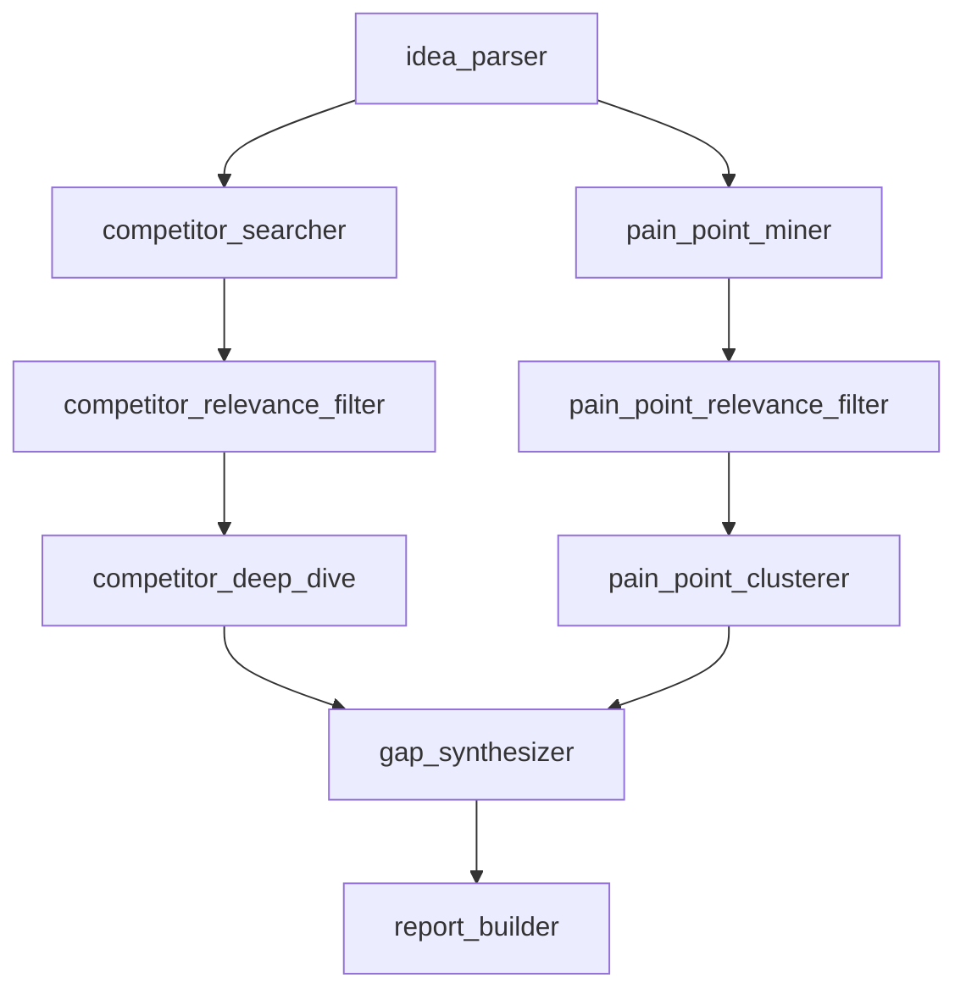

# Product Research Assistant — Technical Design

This builds on `PROBLEM_BRIEF.md`. That doc defines *what* and *why*; this defines *how*.

---

## 1. High-Level Architecture

The system is **asynchronous, job-based**, not a synchronous request/response API. A research run takes 60-180+ seconds — too long for a single HTTP request to survive behind a typical API gateway or a naive synchronous endpoint. So:

```
Client
  │
  ▼
POST /research  ──────────► creates Job (status: "pending"), pushes to queue
  │                          returns { job_id } immediately (202 Accepted)
  │
  ▼
GET /research/{job_id}  ──► poll for status + progress messages
                             ("searching reddit...", "filtering competitors...",
                              "synthesizing gaps...")
  │
  ▼
  Worker (separate process from the API) picks up the job from the queue,
  runs the full agent graph, writes progress + final result back to the
  job store as it goes.
```

**Why this shape**: decouples "accept the request" from "do the slow work," which is the standard fix for long-running tasks behind a web API, and it also gives you a natural place to surface progress to a future UI (poll `GET /research/{job_id}` and show a progress bar/log).

**Components:**
- **API layer** — thin. Accepts requests, creates job records, enqueues work, serves status/results. No agent logic lives here.
- **Queue** — decouples API from Worker. Also gives you retry semantics for free if a worker crashes mid-job.
- **Worker** — runs the actual LangGraph agent pipeline. Long-lived process, polls the queue, updates job status as it progresses.
- **Job store** — holds job status, progress messages, and the final report once done. SQLite for local development; deployment-target DB is TBD.

---

## 2. Agent Graph Topology

This is the core of the system — the LangGraph node graph that takes a raw product idea and produces a research report.

### Graph Diagram



### Design Decisions

1. **Parallel branches after idea parsing.** Competitor search and pain-point mining are independent — they both only need the parsed idea, not each other's results. LangGraph supports this via fan-out from `idea_parser`. This cuts wall-clock time nearly in half compared to sequential.

2. **Relevance filtering is per-branch, not shared.** Competitors and pain points need different filtering heuristics. Competitors: "does this serve a similar user and solve a similar problem?" Pain points: "is this complaint about the same use case the user is building for?" Separate filter nodes, same two-stage pattern (see Section 3).

3. **Pain point clustering before synthesis.** Raw pain points are noisy and redundant (3 Reddit threads might all say "too expensive"). Clustering them into themes *before* they hit the synthesizer reduces token count, improves signal quality, and gives us a natural place to count independent sources per theme — which feeds directly into confidence scoring.

4. **Single gap synthesizer, not per-competitor.** Running synthesis per competitor produces fragmented findings. One pass with all competitor profiles + all pain point clusters lets the LLM do actual cross-referencing.

### Node Responsibilities

| Node | Input | Output | Provider | Model |
|---|---|---|---|---|
| `idea_parser` | `raw_idea` (user text) | `parsed_idea`: category, target user, core problem, key features, competitor search terms, pain point search terms | Gemini Flash | gemini-2.0-flash |
| `competitor_searcher` | `parsed_idea.competitor_search_terms` | `raw_competitor_candidates`: search results from Tavily | — (API call) | — |
| `pain_point_miner` | `parsed_idea.pain_point_search_terms` | `raw_pain_point_candidates`: results from Tavily (general + `site:reddit.com`) and HN Algolia | — (API calls) | — |
| `competitor_relevance_filter` | `raw_competitor_candidates` + `parsed_idea` | `filtered_competitors`: top N relevant candidates with YES/NO/MAYBE + reasoning | Groq | llama-3.1-8b |
| `pain_point_relevance_filter` | `raw_pain_point_candidates` + `parsed_idea` | `filtered_pain_points`: relevant complaints/discussions | Groq | llama-3.1-8b |
| `competitor_deep_dive` | `filtered_competitors` (full page fetch) | `competitor_profiles`: pricing, features, positioning, weaknesses per competitor | Cerebras | llama-3.3-70b |
| `pain_point_clusterer` | `filtered_pain_points` | `pain_point_clusters`: grouped themes with source counts and signal strength | Groq | llama-3.1-8b |
| `gap_synthesizer` | `competitor_profiles` + `pain_point_clusters` + `parsed_idea` | `gaps[]` with evidence + `landscape_summary` | Gemini Flash | gemini-2.0-flash |
| `report_builder` | All synthesis output + `source_map` | `report`: final formatted report with resolved URLs | Groq | llama-3.1-8b |

**Provider assignment rationale:**
- **Gemini Flash** for the two tasks requiring the best judgment: idea parsing (sets up everything downstream — a bad parse cascades) and gap synthesis (the core value of the product).
- **Groq 8B** for high-volume, simpler tasks: relevance filtering (YES/NO classification), clustering (categorization), report formatting (template-based).
- **Cerebras** for competitor deep dive — this is the token-heaviest step (processing full web pages), and Cerebras' 1M tokens/day budget handles it well.
- **OpenRouter** as fallback when any provider is rate-limited or down.

---

## 3. Relevance Filtering: Two-Stage Pipeline

This is the mechanism behind the "relevance filtering" requirement from the problem statement — solving the catch-22 of "you need to read something to know if it's relevant, but reading it is the expensive part."

**Stage 1 — Cheap filter (every raw candidate goes through this):**
- Take the search result's title + snippet only (not the full page).
- Send title+snippet to a small/fast model (Llama 3.1 8B on Groq, which has much higher rate limits) and ask for a simple YES/NO/MAYBE relevance call with one-line reasoning.
- This is cheap enough (tiny input, tiny output, fast model) to run on every single raw candidate without denting the rate-limit budget.

**Stage 2 — Deep filter (only survivors of Stage 1):**
- Only the top N candidates (e.g. top 3-5 competitors, top 8-10 pain-point threads) get their full content fetched and passed to the stronger model for real analysis.
- This is where the expensive tokens actually get spent — and only on things already pre-qualified as likely relevant.

This two-stage structure is also the main lever for controlling cost and rate-limit exposure: Stage 1 is cheap and high-volume, Stage 2 is expensive and low-volume by design.

**Depth setting** (fast vs. deep, from the problem statement) controls how many raw candidates Stage 1 processes, and how many survivors Stage 2 processes. See Section 8 for concrete numbers.

---

## 4. Source Tracking & Citation Integrity (The "Source Map" Pattern)

**Problem**: if you hand an LLM 10 sources and ask it to synthesize findings with citations, it will sometimes mix up which quote came from which URL, or invent a plausible-looking URL that doesn't exist. This directly undermines the "every claim is traceable to a real source" requirement, so it needs a structural fix, not a prompting fix.

**Fix — the LLM never outputs a raw URL. Ever.**

1. During ingestion, every piece of source content gets a short internal ID as it's collected:
   ```
   SRC_01 → { url: "https://reddit.com/r/...", text: "scraped complaint snippet" }
   SRC_02 → { url: "https://competitor.com/pricing", text: "Tier 1 starts at $49..." }
   ```
2. When content is injected into any LLM prompt, it's tagged with its ID (`[SRC_01] ...text...`).
3. The LLM is instructed to cite findings using only these IDs: `{"gap": "Expensive entry tier", "citations": ["SRC_02"]}` — never asked to reproduce or recall a URL from memory.
4. The backend deterministically resolves `SRC_02` → the real URL when building the final report. The LLM's job is pattern-matching "which tagged snippet supports this claim," which models are reliably good at — not "recall and reproduce a URL correctly," which they aren't.

This is a small amount of bookkeeping that removes an entire class of hallucination risk. It's also a good, concrete thing to point to later: "the system is structurally incapable of citing a source that doesn't exist, because the LLM never handles raw URLs."

---

## 5. Gap Synthesis Strategy

This is the core intellectual work of the system. A single mega-prompt fails because: (a) token bloat, (b) LLMs produce vague output when given too much context, (c) no structured way to assign confidence. So synthesis is split into two passes.

### Pass 1 — Pain Point Clustering (Groq 8B)

**Purpose:** Deduplicate and group raw pain points into themes before they hit the expensive synthesis step.

**Input per call:** Batch of ~10-15 filtered pain points (title + snippet, tagged with SRC_IDs).

**Prompt output format:**
```json
[
  {
    "theme": "Pricing is prohibitive for small teams",
    "description": "Multiple users complain about per-seat pricing making tools unaffordable for teams of 2-5",
    "sources": ["SRC_04", "SRC_09", "SRC_15"],
    "representative_quote": { "src_id": "SRC_04", "quote": "We're 3 people, why do I need the $50/seat plan?" }
  }
]
```

**Signal strength is computed deterministically by the backend, not by the LLM:**
- `strong`: 3+ independent sources AND 2+ source types (e.g. Reddit + HN)
- `moderate`: 2 independent sources OR 3+ from same source type
- `weak`: single source

This keeps confidence grounded in countable evidence, not LLM self-assessment.

### Pass 2 — Cross-Reference Synthesis (Gemini Flash)

**Purpose:** For each pain point cluster, check which competitors address it, which don't, and identify gaps.

**Input structure:**
```
PRODUCT IDEA:
[parsed idea summary]

COMPETITORS:
[COMP_1] CompetitorName — Features: [...], Pricing: [...], Weaknesses: [...]
[COMP_2] ...

PAIN POINT CLUSTERS:
[CLUSTER_1] "Pricing is prohibitive for small teams" (strong signal, 3 sources)
  - [SRC_04] "We're 3 people, why do I need the $50/seat plan?"
  - [SRC_09] "Switched to a free tool because pricing got crazy"
[CLUSTER_2] ...
```

**Prompt output format:**
```json
{
  "gaps": [
    {
      "title": "Affordable pricing for micro-teams (2-5 people)",
      "description": "All major competitors use per-seat pricing starting at $10+/seat. Multiple independent complaints about this from small team users, with some churning to free alternatives.",
      "pain_point_evidence": ["SRC_04", "SRC_09", "SRC_15"],
      "competitor_evidence": ["SRC_01", "SRC_05"],
      "competitors_failing": ["Competitor A", "Competitor B", "Competitor C"],
      "competitors_partial": ["Competitor D"]
    }
  ],
  "landscape_summary": "...",
  "positioning_suggestions": ["..."]
}
```

**Confidence is assigned post-hoc by the backend**, not by the LLM, combining the cluster's signal strength with competitor coverage:
- `strong`: strong-signal cluster + majority of competitors fail to address it
- `moderate`: moderate-signal cluster OR only some competitors fail
- `weak`: weak-signal cluster OR only one competitor fails

### Why Two Passes Instead of One

- Pass 1 is cheap (8B model, small input) and reduces 15-20 raw pain points to 4-7 clusters.
- Pass 2 gets a cleaner, denser input — the synthesizer reasons over themes, not noise.
- Confidence is grounded in countable evidence, not vibes.
- Total token cost is lower than a single mega-prompt because clustering removes redundancy before the expensive model sees it.

---

## 6. Data Ingestion Strategy

Start simple and only add complexity where you actually hit a wall.

### Core Sources (v1)

| Source | Method | What It Covers |
|---|---|---|
| **General web** | Tavily search API | Competitor sites, articles, reviews, blogs, forums |
| **Reddit** | Tavily search with `site:reddit.com` query filter | User complaints, discussions, recommendations |
| **Hacker News** | Algolia HN Search API (free, no key required) | Technical/early-adopter reactions, launch feedback |

**Why Reddit via Tavily, not Reddit's own API:** Reddit's native search is notoriously poor quality — it frequently misses relevant threads and doesn't support the nuanced queries this system needs. Searching Reddit through a general search engine (via `site:reddit.com` filter in Tavily) gives better results, avoids OAuth setup, and keeps the ingestion layer simpler. The tradeoff is we can't sort by top/controversial within a subreddit, but for finding complaints about a product category, search quality matters more than sort control.

### Conditional Source: App Store Reviews

When `competitor_deep_dive` identifies that a competitor has a mobile app, it opportunistically pulls 1-2 star reviews:

- **Google Play**: via the `google-play-scraper` Python package (no API key, no rate limit concerns). Returns structured reviews with star ratings, filterable client-side.
- **Apple App Store**: via Apple's public RSS feed (`https://itunes.apple.com/rss/customerreviews/id={APP_ID}/sortby=mostrecent/json`). Returns JSON, no auth required. Limited to ~50 most recent reviews, filtered client-side to 1-2 stars.

This is a **conditional sub-step inside `competitor_deep_dive`**, not a separate graph node. It fires only when a competitor has a mobile app, and the results get tagged into the source map like any other content.

### Page Fetching Strategy

1. **Primary**: Tavily search results already return cleaned snippets/summaries for most pages. This alone covers a large fraction of what you need.
2. **When you need a full page** (e.g. a specific competitor's pricing page): plain HTTP fetch + an HTML-to-text/Readability-style cleanup step to strip nav/footer/script clutter before it reaches the LLM.
3. **If a page is JS-rendered and returns empty content**: try a different search result that has the same info, rely on the search API's own snippet/summary of that page, or skip that specific source. Don't reach for a headless browser.
4. **Headless browser (Playwright, etc.) is a last resort**, not a v1 concern.

### Negative Review Targeting

During `competitor_deep_dive`, after competitor names are known, generate additional search queries specifically targeting negative sentiment:
- `"[CompetitorName] review" "1 star" OR "terrible" OR "disappointed"`
- `"[CompetitorName] problems" OR "issues" OR "complaints"`
- `"alternative to [CompetitorName]" OR "[CompetitorName] vs"` — comparison articles almost always list weaknesses
- `site:trustpilot.com "[CompetitorName]"` — Trustpilot pages show up in search results with ratings in snippets

---

## 7. Rate Limits & Cost Control

The system uses multiple LLM providers to balance capability, cost, and rate limits. Each provider has different budget constraints, and the system is designed to route tasks to the cheapest provider that can handle them well.

### Provider Budgets

| Provider | Role | Daily Budget | Tasks |
|---|---|---|---|
| **Gemini Flash** | Primary reasoning | ~1,500 req/day | Idea parsing, gap synthesis |
| **Groq** | Fast classification | ~14,400 req/day (8B models) | Relevance filtering, pain point clustering, report formatting |
| **Cerebras** | Batch/heavy processing | ~1M tokens/day | Competitor deep dive (full page processing) |
| **OpenRouter** | Fallback + variety | ~1,000 req/day ($10 deposit) | When primary providers return 429s or are down |

### Cost Mitigations (baked into the design)

- **Multi-provider routing**: Tasks are assigned to the cheapest provider that can handle them. Expensive reasoning goes to Gemini Flash; high-volume classification goes to Groq 8B; token-heavy extraction goes to Cerebras. OpenRouter absorbs overflow.
- **Trim input aggressively before it hits the LLM** — the Readability-style cleanup step in ingestion isn't just for readability, it's a token-budget necessity. Raw scraped pages can be 5-10x larger than the actual useful content.
- **Retry with backoff** on 429 responses, built into the worker from day one — treat rate limiting as an expected, normal condition to handle gracefully, not an error state. If the primary provider is exhausted, fall back to OpenRouter automatically.
- **Search API calls are also a scarce resource** — Tavily's free tier is ~1,000 queries/month. The worker logs every search call per job so you can see actual consumption and tune query counts. Cache search results locally during development so repeated test runs don't burn production quota.
- **Token usage tracking per provider per job** — the `ResearchState` tracks cumulative tokens used per provider, enabling post-run analysis of where the budget went.

---

## 8. Depth Settings

The depth setting controls how many candidates the system processes at each stage. This is the primary lever for trading off thoroughness against cost/time.

| Parameter | Fast | Deep |
|---|---|---|
| Tavily search queries (competitor) | 2-3 | 5-7 |
| Tavily search queries (pain points) | 3-4 | 7-10 |
| Max candidates through Stage 1 filter | 15 | 40 |
| Competitors into deep dive (Stage 2) | 3 | 5 |
| Pain points into clustering | 8 | 15 |
| Estimated total tokens (input+output) | ~30K | ~80K |
| Estimated wall-clock time | 60-90s | 120-180s |
| Estimated Tavily queries per run | 5-7 | 12-17 |

---

## 9. ResearchState Schema

All data passed between agent nodes flows through this typed state object. No globals, no side channels.

```python
from typing import TypedDict, Literal

class ParsedIdea(TypedDict):
    category: str                    # e.g. "project management", "note-taking"
    target_user: str                 # e.g. "solo founders", "small dev teams"
    core_problem: str                # one-sentence problem statement
    key_features: list[str]          # what the user described wanting to build
    competitor_search_terms: list[str]  # queries for finding competitors ("best [category] tools 2025")
    pain_point_search_terms: list[str]  # queries for finding complaints ("[category] frustrations reddit")

class SourceEntry(TypedDict):
    url: str
    title: str
    snippet: str
    source_type: Literal["web", "reddit", "hn", "app_store"]
    fetched_at: str                  # ISO timestamp

class CompetitorCandidate(TypedDict):
    src_id: str
    name: str
    relevance_score: float           # 0-1, from Stage 1 filter
    relevance_reasoning: str

class CompetitorProfile(TypedDict):
    src_ids: list[str]               # multiple sources may inform one profile
    name: str
    url: str
    pricing: str                     # extracted pricing summary
    features: list[str]
    positioning: str                 # how they describe themselves
    weaknesses: list[str]            # extracted from reviews/complaints about them
    has_mobile_app: bool             # triggers conditional app store review fetch
    app_store_reviews: list[dict]    # 1-2 star reviews if mobile app exists

class PainPointCandidate(TypedDict):
    src_id: str
    text: str
    relevance_score: float
    relevance_reasoning: str

class PainPointCluster(TypedDict):
    theme: str                       # e.g. "pricing complaints", "missing offline support"
    description: str
    source_count: int                # number of independent sources
    source_diversity: list[str]      # which source types represented ["reddit", "hn", "web"]
    representative_quotes: list[dict]  # [{"src_id": str, "quote": str}]
    signal_strength: Literal["strong", "moderate", "weak"]

class Gap(TypedDict):
    title: str
    description: str
    confidence: Literal["strong", "moderate", "weak"]
    confidence_reasoning: str
    pain_point_evidence: list[str]   # SRC_IDs
    competitor_evidence: list[str]   # SRC_IDs
    competitors_failing: list[str]   # competitor names
    competitors_partial: list[str]   # competitor names

class ResearchState(TypedDict):
    # Input
    raw_idea: str
    depth: Literal["fast", "deep"]

    # Parsed
    parsed_idea: ParsedIdea

    # Source Map — grows as sources are collected across all nodes
    source_map: dict[str, SourceEntry]

    # Competitor branch
    raw_competitor_candidates: list[dict]
    filtered_competitors: list[CompetitorCandidate]
    competitor_profiles: list[CompetitorProfile]

    # Pain point branch
    raw_pain_point_candidates: list[dict]
    filtered_pain_points: list[PainPointCandidate]
    pain_point_clusters: list[PainPointCluster]

    # Synthesis output
    gaps: list[Gap]
    landscape_summary: str

    # Final
    report: str

    # Job metadata
    job_id: str
    status: Literal["pending", "running", "completed", "failed"]
    progress_messages: list[str]
    errors: list[str]
    token_usage: dict[str, int]      # per-provider token tracking
```

---

## 10. Tech Stack

| Layer | Choice | Why |
|---|---|---|
| Agent orchestration | LangGraph | Explicit state, conditional/branching graphs, parallel fan-out, checkpointing |
| LLM (reasoning) | Gemini Flash (via Google AI API) | 1,500 req/day free, strong reasoning for parsing and synthesis |
| LLM (classification) | Groq (Llama 3.1 8B) | 14,400 req/day free, fast inference for filtering/clustering |
| LLM (batch processing) | Cerebras (Llama 3.3 70B) | 1M tokens/day free, handles token-heavy competitor page extraction |
| LLM (fallback) | OpenRouter ($10 deposit) | 1,000 req/day across 28+ models, absorbs overflow from other providers |
| Search | Tavily | Built for LLM use, returns clean snippets, ~1,000 queries/month free |
| HN data | Algolia HN Search API | Free, no key required, well-documented |
| App store reviews | `google-play-scraper` (Python) + Apple RSS | Free, no API keys, conditional use only |
| Backend API | FastAPI | Lightweight, async-friendly, easy to containerize |
| Job/state store | SQLite (local dev) | Simple, no external dependencies; deployment DB is TBD |
| Worker | Long-lived Python process | Avoids serverless timeout/cold-start issues for long research runs |
| Containerization | Docker | Local/prod parity |
| Observability | LangSmith free tier (tracing) | Debuggability for non-deterministic agent runs |

---

## 11. Build Sequence

1. **Local, synchronous, in-memory** — get the full agent graph working end-to-end as a script, no API, no queue, no persistence. Validate the relevance filter, source-map citation approach, and gap synthesis pipeline here first, since those are the highest-risk/most-novel parts.
2. **Wrap in FastAPI, still synchronous** — a single `/research` endpoint that blocks until done. Fine for local testing even though it won't survive as the production shape.
3. **Add the job/queue/worker split locally** — SQLite for the job store, a simple in-process or local-queue-based worker, `POST /research` + `GET /research/{job_id}` polling. This is where the real target architecture gets proven out, still entirely on your machine.
4. **Dockerize** — API and Worker as separate containers (they scale/fail independently), `docker-compose up` running both plus SQLite.
5. **Deploy** — target environment TBD. The async job architecture is provider-agnostic — it works the same way whether the queue is SQS, Redis, or an in-process queue.
6. **CI/CD + observability layer** — GitHub Actions pipeline, LangSmith tracing wired in.

---

## 12. Resolved Design Decisions

- **Report format**: Both. `report_builder` produces structured JSON (for programmatic use and a future UI) plus a Markdown rendering (for direct human consumption). The API returns both formats.
- **Search query generation strategy**: `idea_parser` produces separate query lists — `competitor_search_terms` and `pain_point_search_terms`. Competitor-hunting queries ("best [category] tools 2025", "[category] software comparison") differ fundamentally from pain-point queries ("[category] complaints frustrations reddit", "problems with [category] tools").
- **Competitor deep dive chunking**: Readability-style HTML cleanup as the default processing step, with a hard token cap (e.g. 4K tokens) as a safety net. If cleaned content still exceeds the cap, truncate — pricing and feature info is almost always near the top of the page.
- **Progress update granularity**: Start with per-node stage labels — simple and sufficient. Each node updates `progress_messages` on entry (e.g. "Searching for competitors...", "Filtering pain points...", "Synthesizing gaps...").
